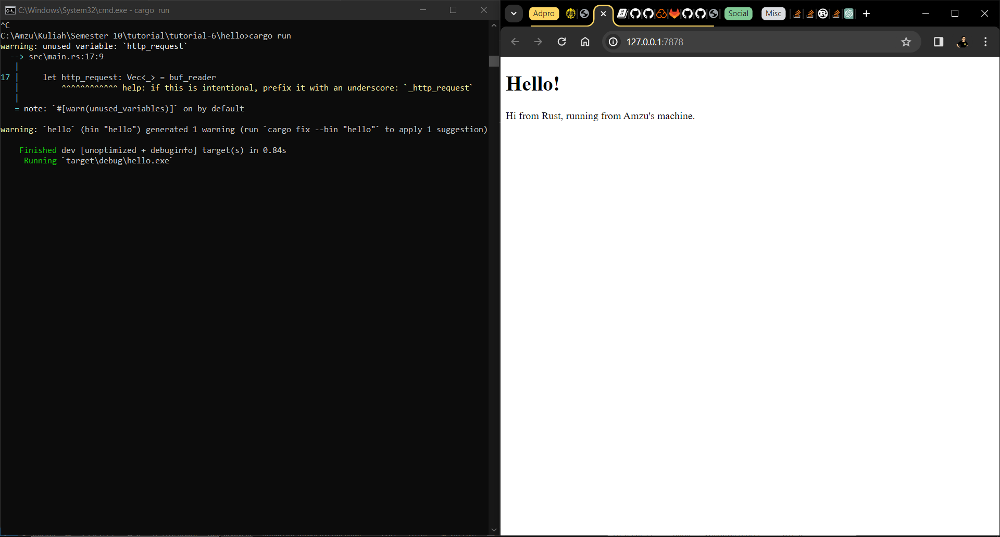
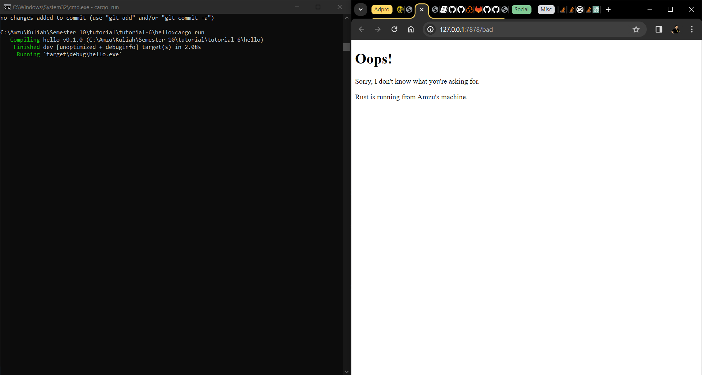

# Tutorial 6

## Commit 1 Reflection Notes
The `handle_connection` function takes a mutable reference to a `TcpStream`. Inside this function, a `BufReader` is created from the `TcpStream` to efficiently read lines of data from the stream.

The `lines()` method of BufReader returns an iterator over the lines of data. The `map()` method is used to unwrap each line. The `take_while()` method is used to collect lines until an empty line is encountered, indicating the end of the HTTP request. The collected lines are stored in a `Vec<String>` named `http_request`. Finally, the contents of `http_request` are printed to the console using `println!()`.

## Commit 2 Reflection Notes

The `handle_connection` functions is a simple HTTP server written in Rust. It listens for incoming TCP connections on the address `127.0.0.1:7878` and responds to each request with the contents of a file named `hello.html`. It sends a basic HTTP response with a status line, content length, and file contents.

## Commit 3 Reflection Notes

The `handle_connection` now handles two possible GET requests using if-else which reads the `request_line`. If the `request_line` is "GET / HTTP/1.1" then the code will respond back with the `hello.html` template file. Otherwise it will return the `404.html` template. Refactoring the code is necessary so that it is easier to read and to maintain.

## Commit 4 Reflection Notes
When user enter the `/` URI a few times, as before, user will see it responds quickly. But if the user enter `/sleep` and then load `/`, the user will see that `/` waits until sleep has slept for its full 5 seconds before loading.
